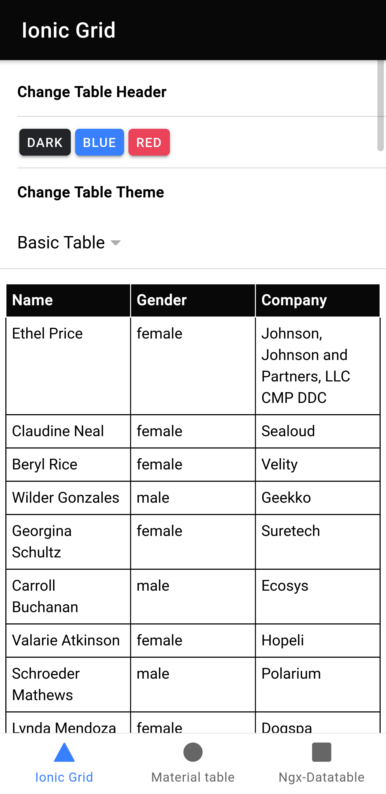
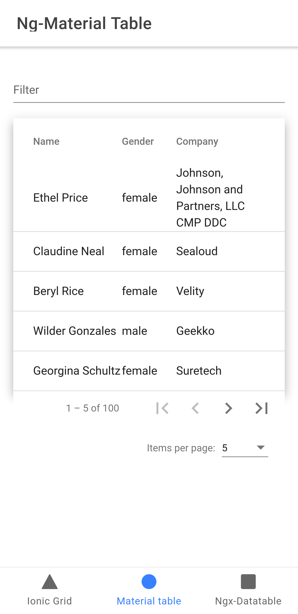
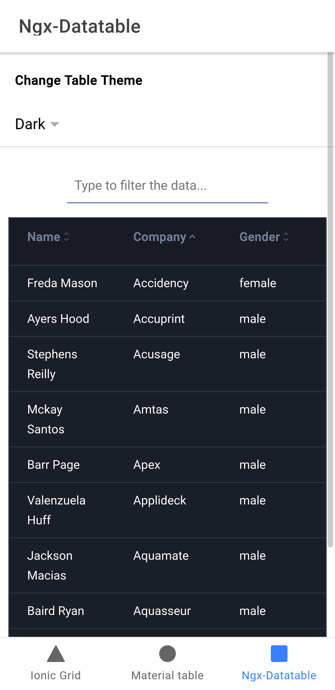

# ionic-5-tables
We have explain and demonstrate Ionic table with grids, Material design tables, and ngx-datatables.

## Live Demo 
Will post new article link here

## Output

## Contributor
[https://sbsharma.com/ionic](https://sbsharma.com/ionic)
